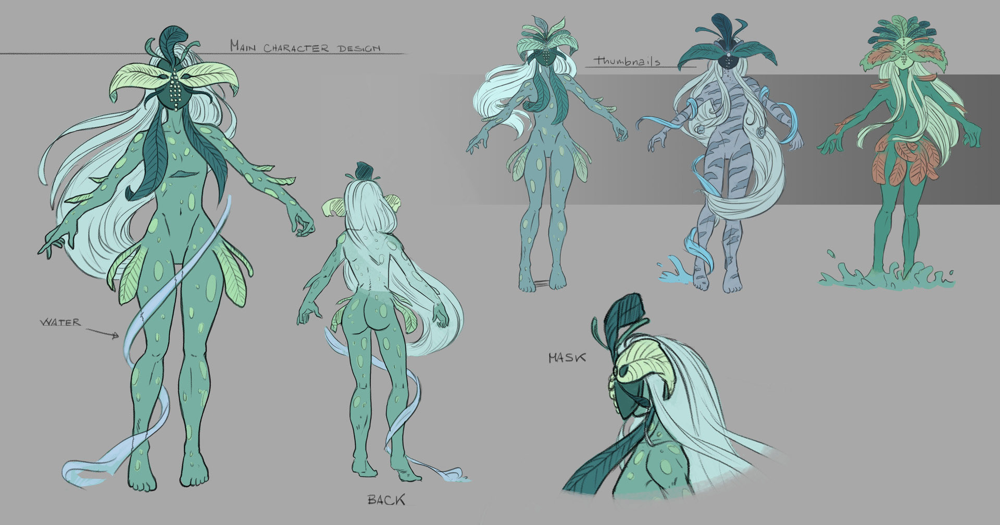

# Hold me

  <i>Hold me</i> is a song composed by <a href="http://saradesantismusic.tumblr.com/">Sara de Santis</a>, a musician and composer based in London, UK.
    
  I had the pleasure to work with her on her music video, designing the main character and animating some of the clips.
    
  You can find some of her best producions on her <a href="https://soundcloud.com/zaazkeys">Soundcloud</a>.

###Character Design
[[block]]
| 

### Some shots

[[block]]
| {{ VideoNoAutoplay url="scene-1.mp4" }}

[[block]]
| {{ VideoNoAutoplay url="scene-2.mp4" }}
