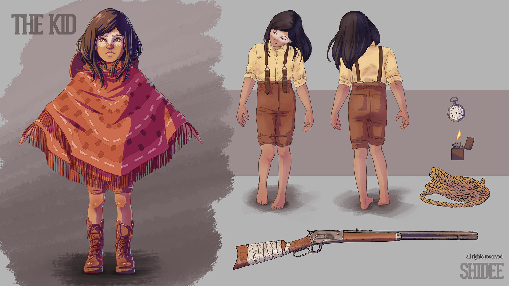
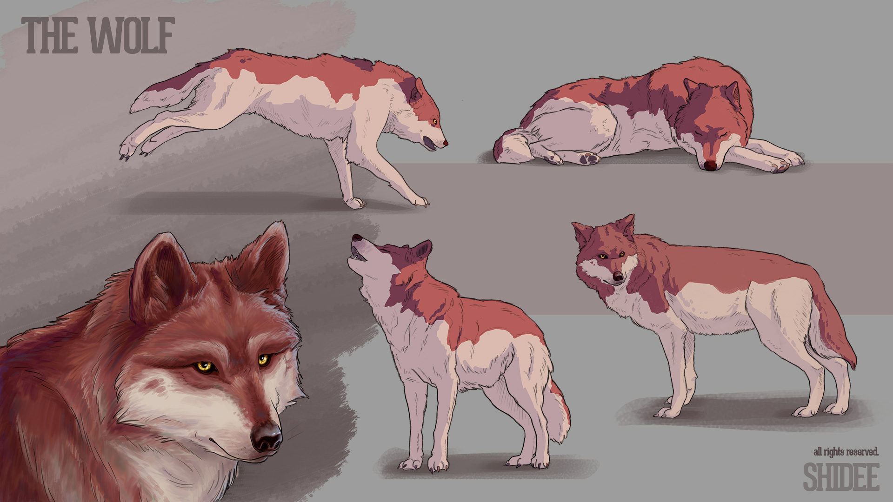
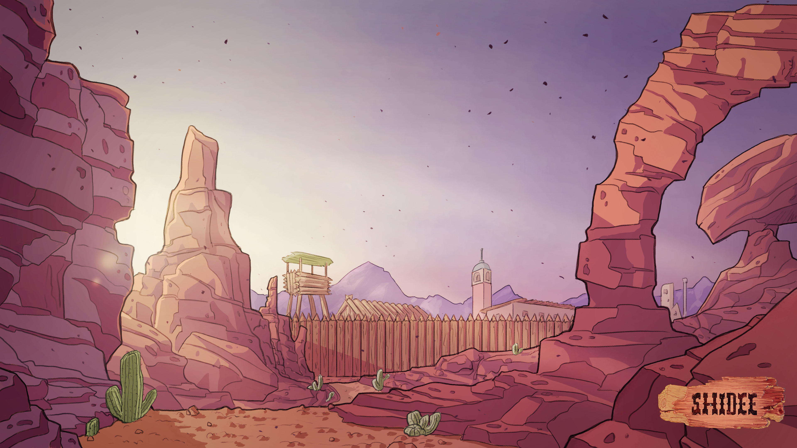
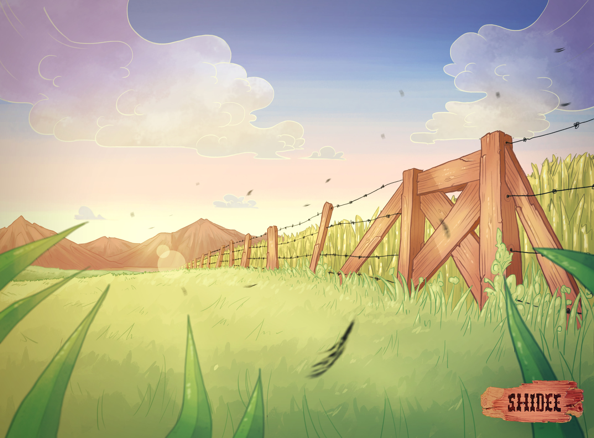
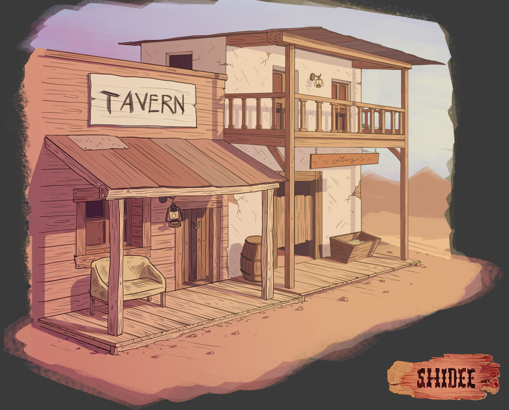
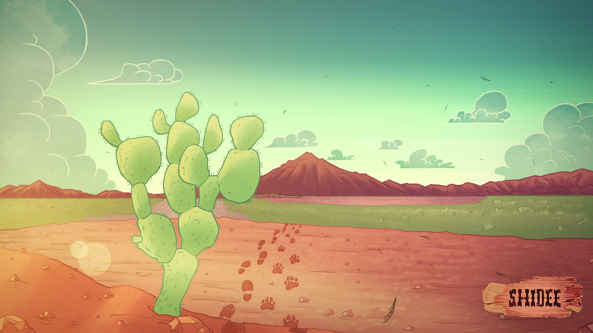
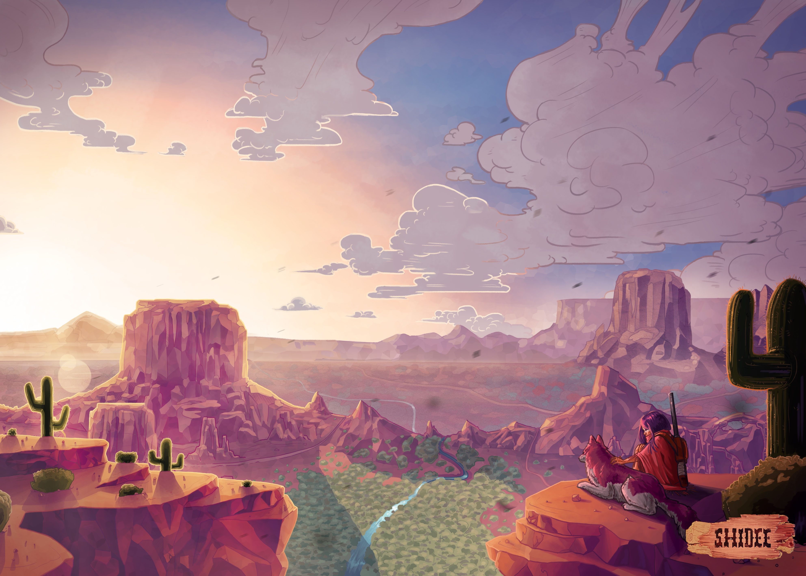
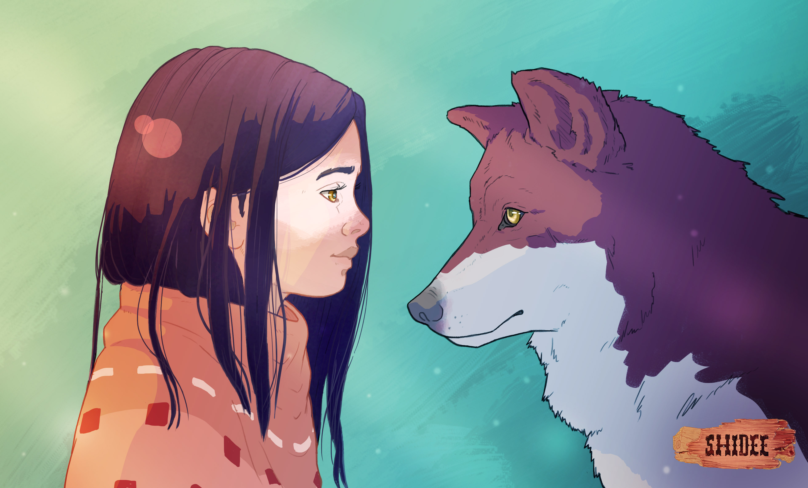
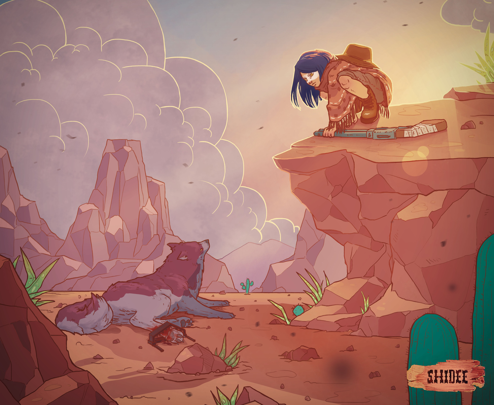
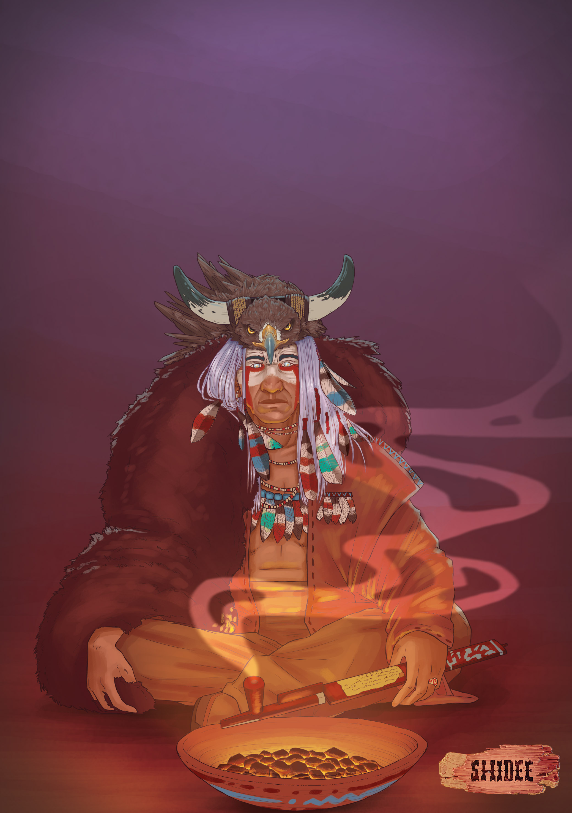

# Shidee

<i>Shidee </i>is an RPG story game, masterless, for two players. The game tells the story of a young boy/girl and a wolf, and their travel together.
Shidee is written by  <a href="https://www.fabriziobotto.games/">Fabrizio Botto</a>   and distributed in Italy by <a href="https://www.terradeigiochi.it/">Terra dei giochi</a>. The International Version release is scheduled for early 2019.
 
I designed the characters and the environments of the game as well as produced the final illustrations of the manual.
 
For more information about the game or to buy it visit <a href="https://www.terradeigiochi.it/home/3042-shidee-limited-edition-preorder-9788832082005.html">Terra dei Giochi</a>'s website.

## Character Design

[[block]]
| 
[[block]]
| 

## Environments

[[block]]
| 
[[block]]
| 
[[block]]
| 
[[block]]
| 

## Scenes

[[block]]
| 
[[block]]
| 
[[block]]
| 
[[block]]
| 
