# Sketchbook

This is a collection of my sketches: those I make in my free time in order to keep my creativity flowing and still enjoy drawing as hobby. 

### Hybrid

[[block]]
| 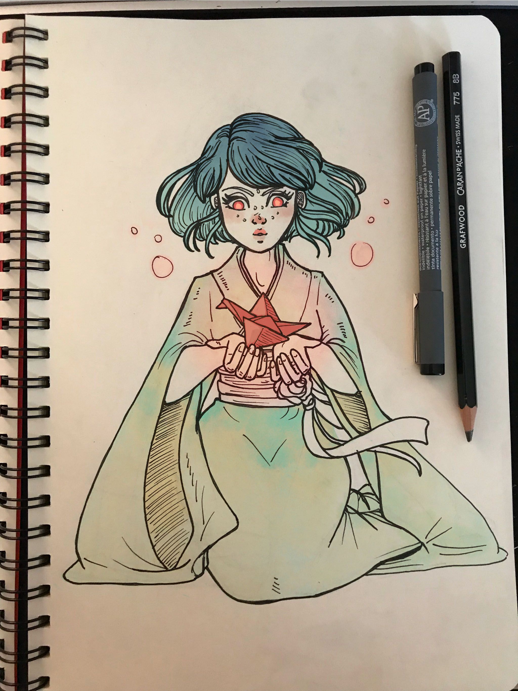

[[block]]
| 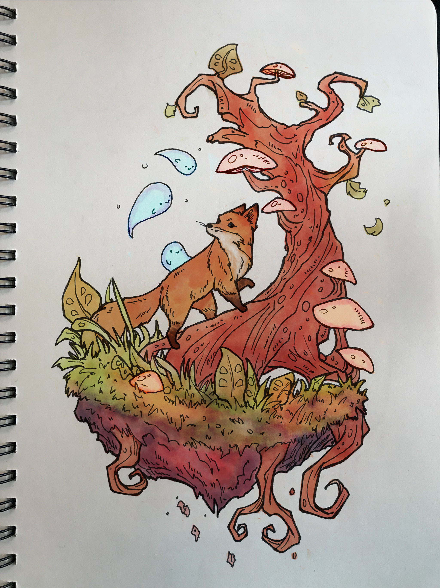

### Traditional

[[block]]
| 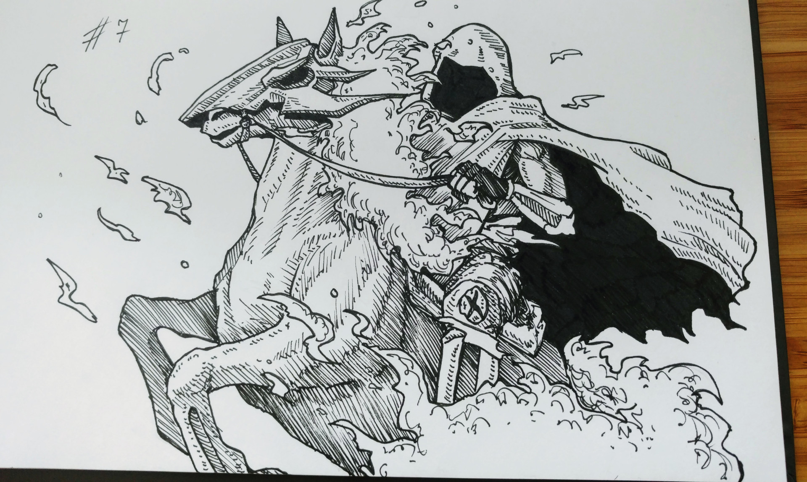

[[block]]
| 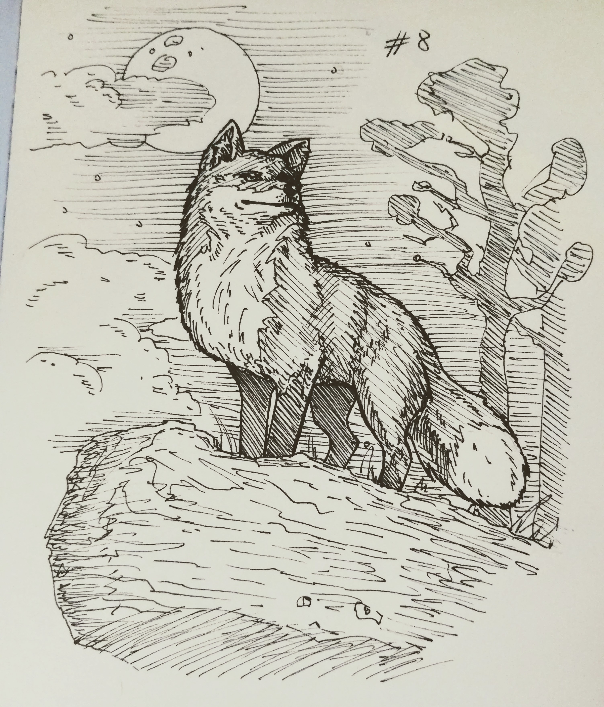

[[block]]
| 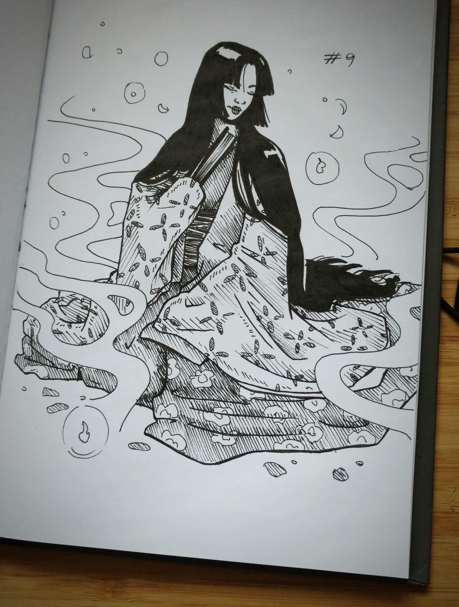

[[block]]
| 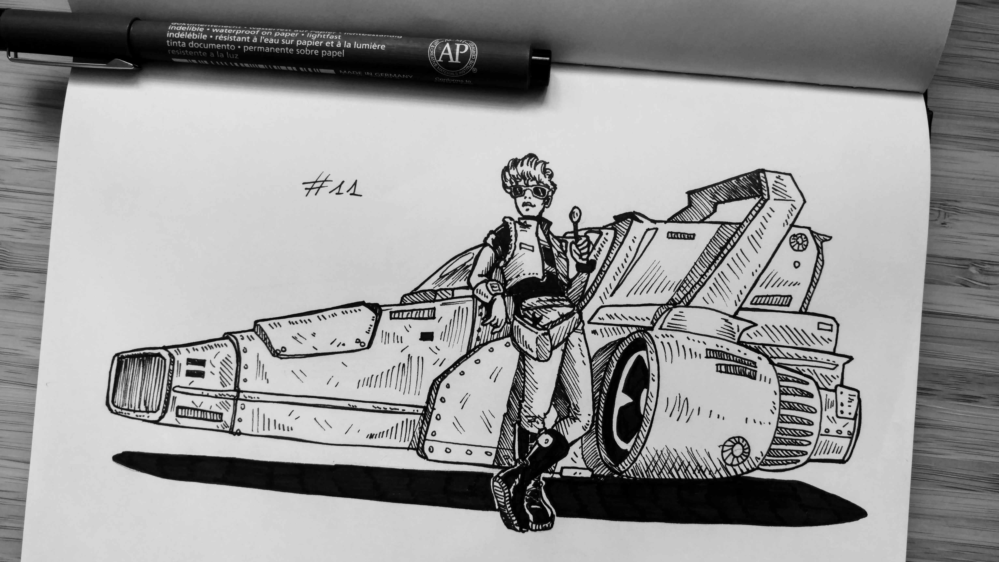

[[block]]
| 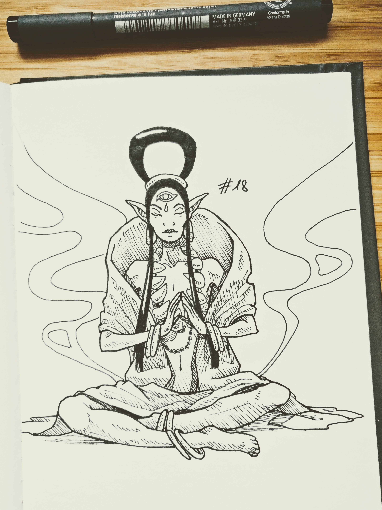

[[block]]
| 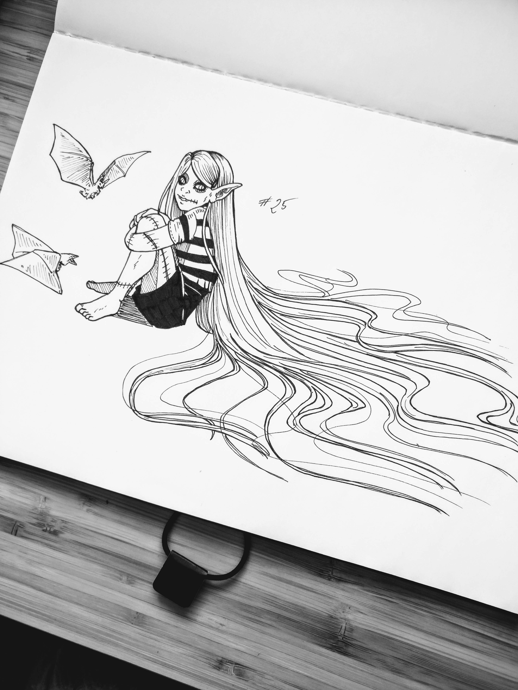

[[block]]
| 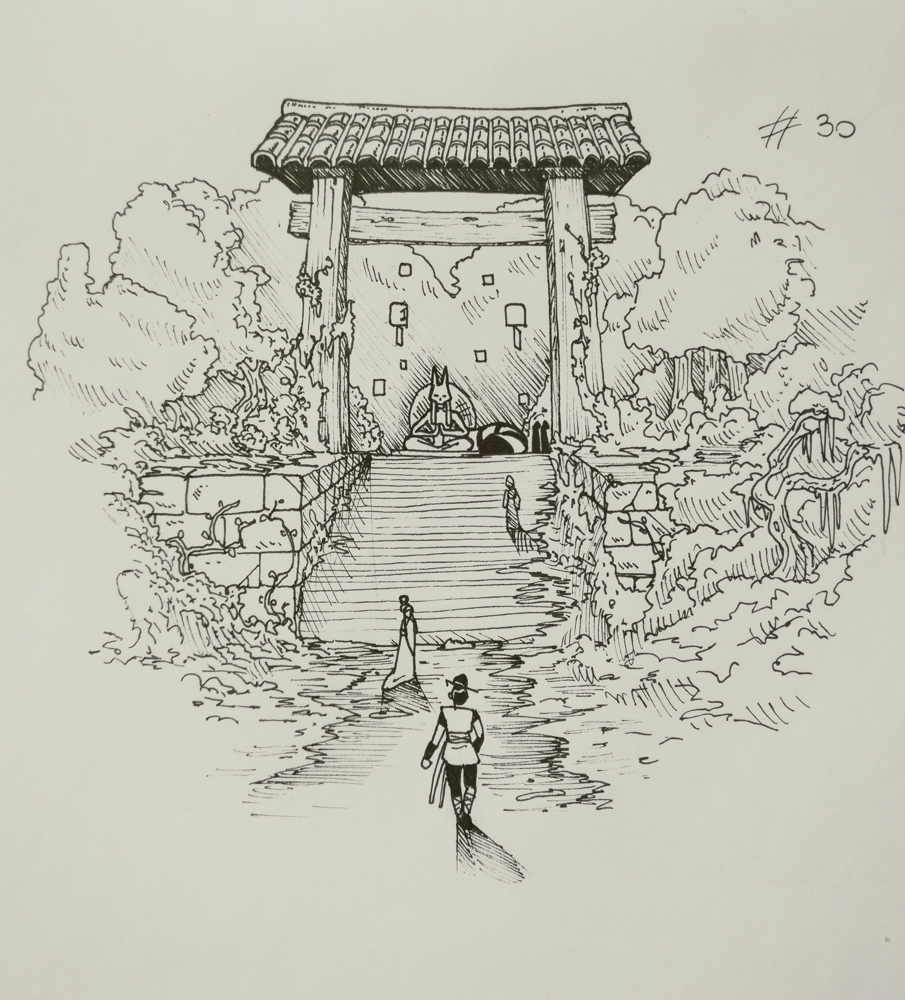

[[block]]
| 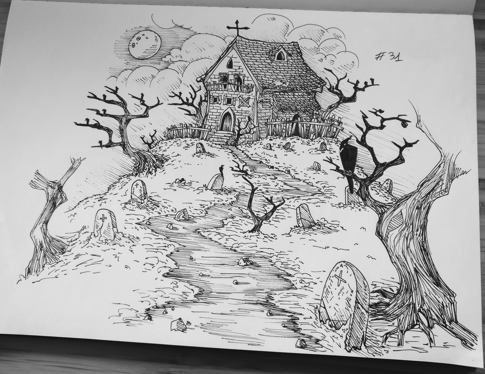

### Digital

[[block]]
| 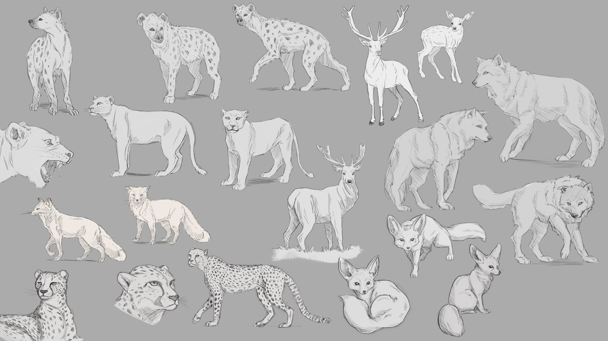

[[block]]
| 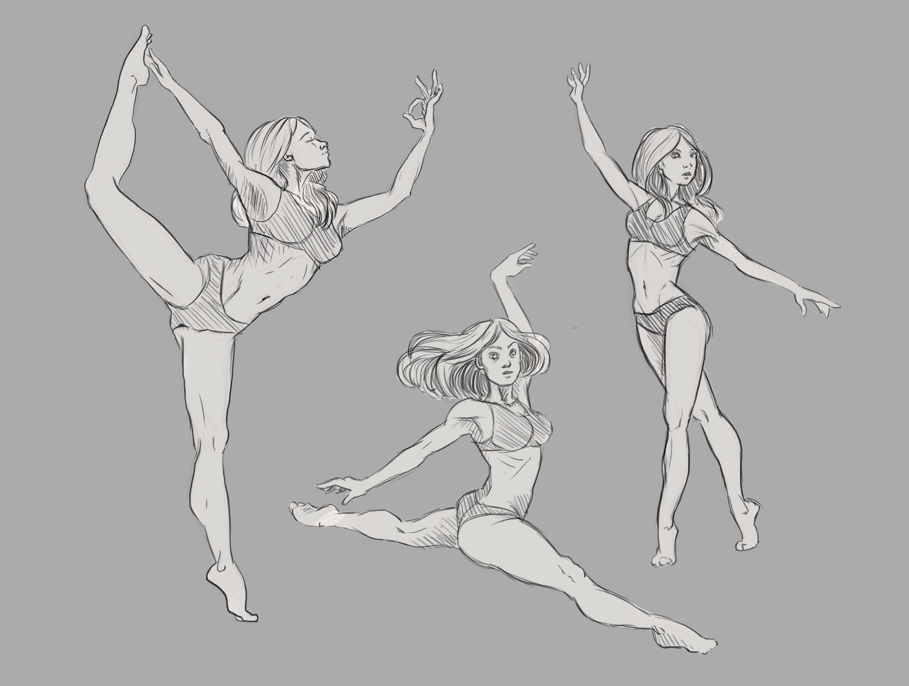
