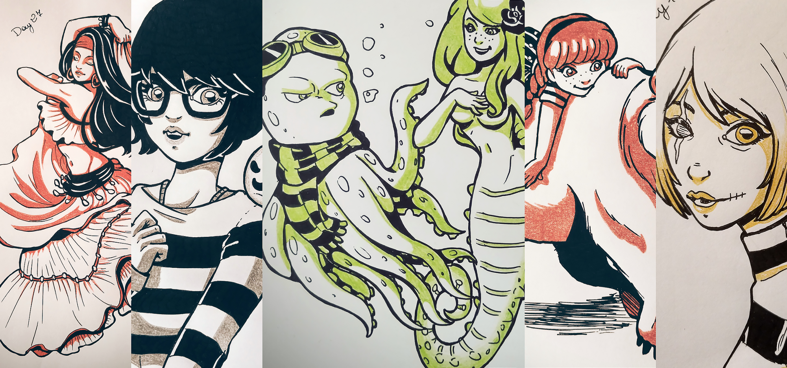
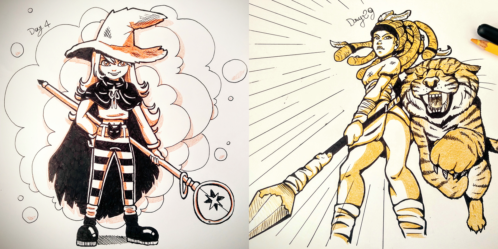

# Challenge yourself as an artist

I spent all my high school and university years drawing on every piece of paper I could find. I was the kind of student always doodling on every note and books’ corner. During classes and at home.

As I started working in the industry I’ve been drawing much more on my computer than on paper. A few months ago I learned about Inktober: Created by [Jake Parker](http://mrjakeparker.com/inktober) in 2009, it’s a challenge to improve inking and drawing skills by doing one ink drawing a day the entire month of October.

I got really exited and I decided to participate. At first I thought about picking a concept for the whole challenge, as some other artists do, but I decided to go for the blind-folded approach. This way the challenge required my creativity alongside my drawing skills.

Inktober ended a bit more than a month ago and I finally found some time to write down my thoughts about it and what I learned.

## Organization & Time

First of all: **finding the time each day can be quite hard**. This sounds obvious but trust me it’s not.

As a freelance I work most of the time from home. I have to organize my time between clients’ deadlines and personal projects, alongside my personal life. And it took me some time to fine tune my schedule and be happy with it.

It’s easy to procrastinate if you don’t have strict deadlines. It typically happens to creative minds and [it can actually help increase creativity](http://www.nytimes.com/2016/01/17/opinion/sunday/why-i-taught-myself-to-procrastinate.html).

But, if you give yourself a daily task like Inktober and you want to carry it out, you can’t afford to procrastinate: **you need to get your stuff done**. And that’s why commitments like this might help you improve managing priorities day by day.

During the month unexpected things will happen: I found myself rushing the drawing late at night a couple of times, but I never gave up.

## Developing creativity

Finding a new subject each day was tough. The first days I almost regretted not having chosen a common concept. But then I got used to it.

By the end of the month I developed a *library* in my mind I could reach on to and I could elaborate whenever I needed (i.e. types of characters, environments & settings, etc.).

Creativity is something you **learn and develop with experience and practice**, you are not born with it. [Quantum mechanics supports](http://www.enchantedmind.com/html/science/quantum_brain.Html) the theory that personal creativity is developed stimulating the brain in order to create more synapsis.

## Everyday practice

When I was a student I though being a professional Illustrator meant you would simply end up just drawing every day.

Well, soon enough I acknowledged the fact that you need to take care of other things besides actual illustration. I often spend whole days just organizing my work, maintain relationships with clients and (whenever I can) side projects.

When Inktober started I was coming from a long period of digital-only and I missed the exercise of good ol’ drawing. **One more excuse to practice every day**.

31 drawings don’t seem a lot, but looking back I instantly spot the difference between the first few and the latest: complexity improved alongside my self-confidence with lines, and the overall approach to the scene.

Throughout the exercise as I was more comfortable with the technique **I focused more on the story telling**.

## Promoting yourself

I was never really interested in putting too much effort towards social media in general. Last year I started dedicating time to Twitter and Instagram and I’ve been gladly surprised by the outcomes.

Getting to know active people in the community led me to **broaden my perspective regarding illustration in general and my life as a freelance**. I now keep in touch with people around the world and it’s awesome how much we share and learn.

Sharing my work allowed me to analyze my content, see what people liked more and what less. One thing I learned this way is this: *a story behind the draw helps people connect with it*.

As I gained confidence I started approaching my drawings as **frames of some hypothetical animation**, by giving it motion, as opposed to just present a couple of characters in pose. The end result is definitely more dynamic and engaging and leave people wondering what could be next.

As I said I’ve never invested too much on social platforms. Sharing content everyday made me realize that **how you share it is as much important as what you share**. At the end of the day people connect more with you and you connect more with them.

Princeton University researcher Uri Hasson [even says](https://www.ted.com/talks/uri_hasson_this_is_your_brain_on_communication) that [brains of the person telling a story and listening to it can synchronize](http://blog.ted.com/what-happens-in-the-brain-when-we-hear-stories-uri-hasson-at-ted2016/). It’s no news that story telling triggers in people emotional reactions and often make them project the story onto their experiences.

This is a broad topic and this post is not about it, but I do suggest you take a look at this [TED talk by Andrew Stanton](https://www.youtube.com/watch?v=KxDwieKpawg) if you are curious enough.

This interpretation of Inktober is quite close to the original idea and probably the best way to approach it the first time, rather than later.

Next years I’d like to give it a more complex and structural approach (perhaps as and excuse to create a whole story) as many experienced artists already do.

Thank you for reading and I hope my experience and my thoughts can be helpful for you.

See you next time ^_^

PS: If you would like to take a look at my Inktober 2016 works here’s the twitter thread:

<blockquote class="twitter-tweet" data-lang="en">
<a href="https://twitter.com/hashtag/inktober2016?src=hash&amp;ref_src=twsrc%5Etfw">#inktober2016</a> Day 1, let&#39;s start! 🎉 🎉 <a href="https://twitter.com/inktober?ref_src=twsrc%5Etfw">@inktober</a> <a href="https://t.co/FHYz3ugZ33">pic.twitter.com/FHYz3ugZ33</a>
&mdash; Arianna Belotti (@_ariabba) <a href="https://twitter.com/_ariabba/status/782240053410037762?ref_src=twsrc%5Etfw">October 1, 2016</a></blockquote>

