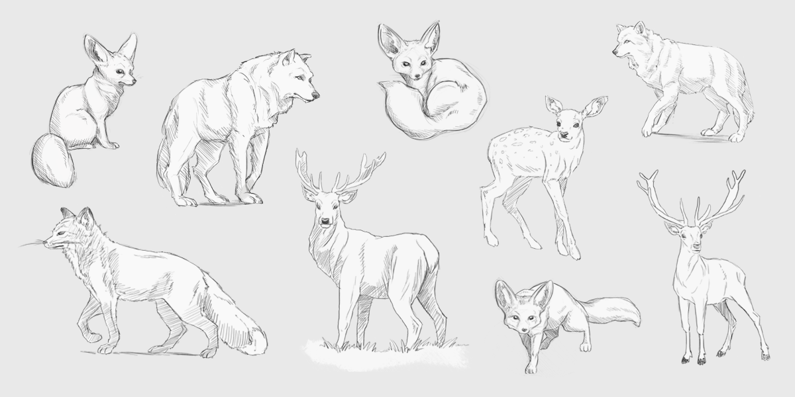
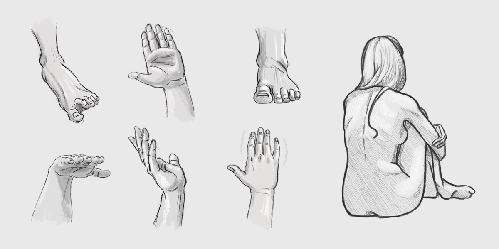

# What I learned from sketching every day for a year

I believe that **sketching is the most important thing you can do to become an artist**.
Without strong sketching and drawing skills it’s almost impossible to create professional work.
Line work can tell a lot about how artists understand the world around them, how accurately they describe light and shadow and how they shape and compose.

**I started taking the time to sketch every day** in the morning right before work, more than a year ago, and I decided to analyse how this exercise has been good for me.

## Everything starts with observation

My go-to approach when drawing was to decide a subject, pop up a blank document and just draw for hours.

Most of the times the end result was **totally different from the one I had in mind**, and it was bugging me.
**The solution was to simply work with references**.

I was then spending most of the time looking at the subject than actually drawing.
**And my works improved a lot because of this**.

New first rule: _always look before drawing_.

### Why is that?

Humans think and see in three dimensions but drawings are 2D, so **directly representing the world around us on a paper is tricky**!
The brain synthesizes shapes for us to help us storage a lot information with the minimal effort possible.

**Drawing** on the other hand **is a tool created to resemble reality in the best way possible**, so we need to actively work against our brain and use as meaningful and accurate details as possible.

_Understanding this process of synthesis is the key in choosing the right details when drawing, literally reverse-engineering the brain_.

**Lighting has a big part in this** as the pictures our eyes can see are actually just light.
The way it interacts with the world (bouncing around) **tells the brain a plethora of information: materials, sources, shadows, temperature and so on**.

Bottom line: the more I learn to observe, the more my drawings improve.

This reminds me of an [awesome video](https://www.youtube.com/watch?v=L5cAnxNVWkw) by [SmarterEveryDay](https://www.youtube.com/channel/UC6107grRI4m0o2-emgoDnAA) on how talking backwards is much more complicated than reading backwards, as you need to reverse-engineer the phonetic sounds.

## Perseverance and repetitiveness

When I started approaching 2D art I just wanted to create beautiful scenes, and **I wanted to learn everything involved altogether**.
But **the brain can only process so much** information at a time and the risk is to stall and overwhelm yourself.

Just as with any other complex ability, it takes time and practice to master it.
**The key is to break it down in smaller actions/skill and learn them one by one**.

Each of this smaller piece requires practice, and that means repetitiveness, even if it sounds boring.

You can only learn to draw a proper horse by drawing thousands of them and observing even more.

This is why I started keeping digital and physical sketchbooks.

**This has helped me embracing mistakes**. "I made one that looks off, no problem, down with another one". And another one, until you get it right.

Mistakes are a necessary evil.
The more errors you become aware of, the more things you can improve.

_It's more an exercise for the brain than for the hand_.

## Experimenting styles and techniques

Repetition quickly led to boredom. The only way to keep on going was to **introduce small enough variables** to make it different while still repetitive.

On the long run I noticed I started to get out of my comfort zone, experimenting on all sort of levels.

I used to draw almost exclusively animals and human characters.
I gradually switched towards human-made stuff such as vehicles and machines, expanding my visual library.
**I used to be scared of drawing this stuff**, too afraid to make mistakes.

After years of Photoshop I suddenly switched to [Krita](https://krita.org/en/), a great Open Source software (and much recommended!).
Even the small differences in the main tools (such as the lasso, blending modes and brushes) changed my overall approach to digital painting.
I also try to constantly change the brushes I use to try different rendering techniques, to find right one for the job.

## It's not only about work

Setting a high bar of expectations keeps me motivated, but it also puts a lot of pressure on my shoulders, having to constantly improve and wanting to get something out every time.

I used to think I needed to have something to show for everything I drew.
If it wasn't good enough for my portfolio or social media it wasn't good enough at all.
This made me forget about how I enjoy drawing in itself, just like when I started when I was a kid.

Looking back now, **my best work was done without work-related pressure**, as my mind could float and take the time it needed.

It's important for me to always remember the fact that I just enjoy drawing.

_It all started as a passion.
And as any passion, it must be cultivated_.

## Developing creativity

I like how these right-before-work sketches are usually called _warmup sketches_.

Just like in sports, you cannot dive into something from a _cold_ state otherwise your performance will be negatively affected.
The brain is just like any other muscle, **creativity doesn't simply flow at request, you need to warm it up**.

Furthermore I noticed that the _warmups_ **help me switch my attention from everyday/private life to work**.
They help me reduce my [attention residue](https://ideas.repec.org/a/eee/jobhdp/v109y2009i2p168-181.html).

I tend to approach them with _autopilot mode_. If I start thinking about them too much I simply create new residue and they lose purpose.

Sometimes looking at my warmups I find something worth following up and further develop them.

_Creativity isn't just a switch you can turn on, several factors come into play.
One of those is your subconscious_.

This has been my experience so far. I'll surely notice new things as I continue and maybe I'll update this post or write a follow up.

What are your experiences? Comments are feedbacks are welcome!
