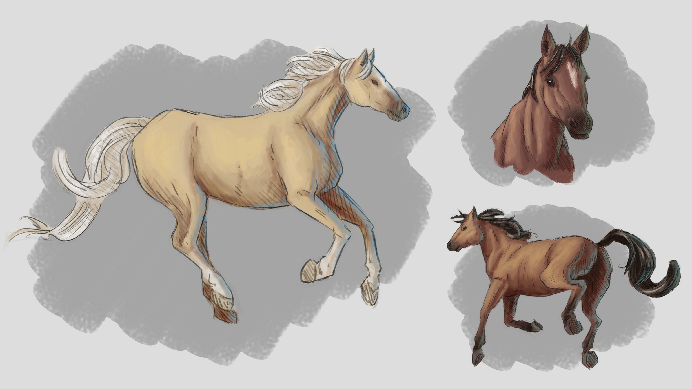
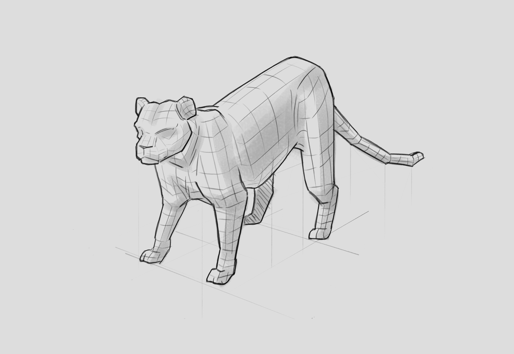
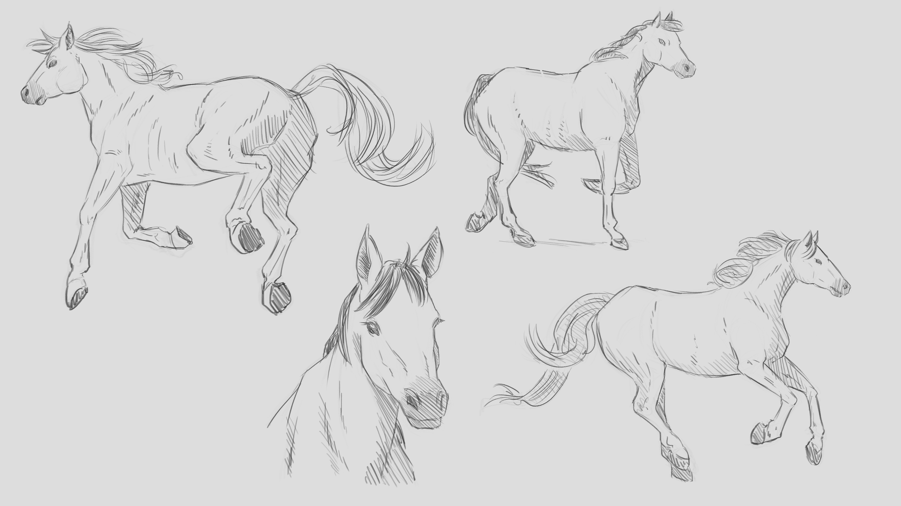
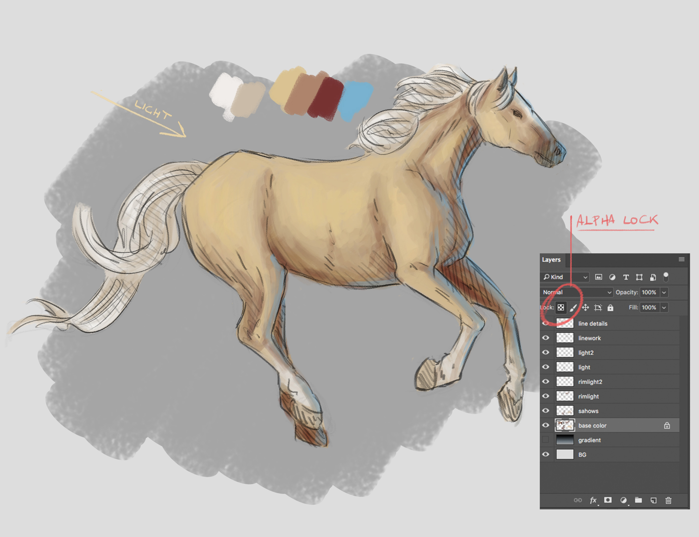

I spent a few months working on improving my anatomy knowledge of animals/creatures in order to design them better.
After some study and exercises I decided to sum up my workflow that came out of it.

The first thing I do when I want to draw organic creatures is to **look around for references**, trying to find different angles, perspectives and details.
(I recommend [Line of Action](https://line-of-action.com/) and [Unsplash](https://unsplash.com/)).

Once I'm satisfied with the material I have and the observation I've done, I start **drawing the main masses**.
I try and **think in 3D: synthesizing shapes into simple geometries** such as cubes and spheres.
As [explained by Feng Zhu](https://www.youtube.com/watch?v=UrbfOpIP_UY), it really helps to present the subject as if it was a product, regardless of its nature.

> _PS: If you don't know him I really recommend to check out [his channel](https://www.youtube.com/channel/UCbdyjrrJAjDIACjCsjAGFAA)._

Drawing the **subject in different poses** and **from different angles** helps me understand the anatomy of its muscles and bones.
The best thing is to commit to try unusual poses and actions instead of the classic flat front camera.

Once ok with the proportions I proceed with the line-work, cleaning it up.
This is an important step: **a good line-work is important for underlining weights and suggest tri-dimensionality** and sets the base for a good colouring result later on.

Next step is the colouring. I start with a pretty flatly **base colour** (the neutral colour an object has in absence of direct illumination).

> _Tip: Use the alpha lock on the base colour layer. Having the silhouette locked down it's quick and convenient for shading_

Materials and surfaces react to the environment around them, and the colour we perceive it's a combination of a bunch of lights that bounce around.
I can **start mixing new hues and gradients** to recreate this effect and **give the subject more depth**.

In order to do this, I usually set up a primary light source pointed directly to it.
This defines where the shadows are casted, and therefore where the highlights should be.

Real-world scenes have many light sources (direct and indirect): in fact it's pretty rare to find something lighten by a single one. Adding secondary light sources such as rim lights (a **rim light** typically comes **from beside or behind your subject**) helps create a believable picture.

I prefer to use a warm colour for the primary light and a cool one for the rim light, but both can be any colour you want.

---

I recorded the whole process in the video if you want to take a quick look ^\_^

[[video]]
| <iframe src="https://www.youtube.com/embed/0eadFa7guak?rel=0&amp;showinfo=0" frameborder="0" allow="autoplay; encrypted-media" allowfullscreen></iframe>
